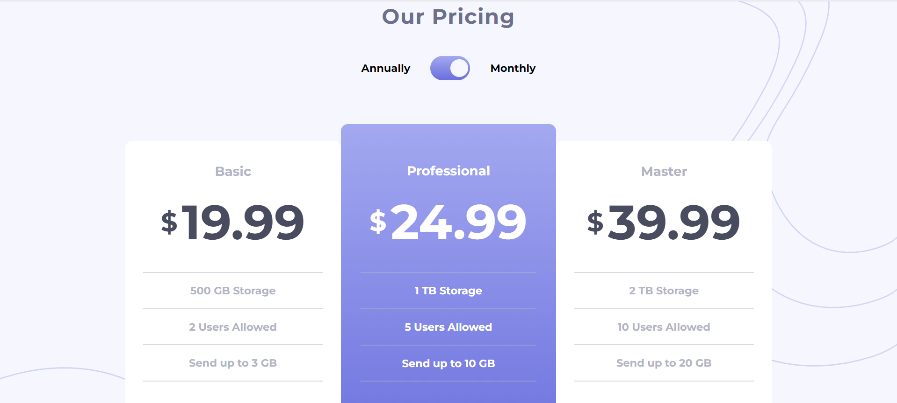

# FRONTEND MENTOR - PRICING COMPONENT WITH TOGGLE SOLUTION

This is a solution to the [Pricing component with toggle challenge on Frontend Mentor](https://www.frontendmentor.io/challenges/pricing-component-with-toggle-8vPwRMIC). Frontend Mentor challenges help you improve your coding skills by building realistic projects.

## Table of contnents

- [Overview](#overview)
  - [The Challenge](#the-challenge)
  - [Screenshot](#screenshot)
  - [Links](#links)
- [My Process](#my-process)
  - [Built With](#built-with)
  - [Code Snippet](#code-snippet)
- [Author](#author)

## Overview

### The Challenge

Users should be able to:

- View the optimal layout for the component depending on their device's screen size
- Control the toggle with both their mouse/trackpad and their keyboard
- **Bonus**: Complete the challenge with just HTML and CSS

### Screenshot



### Links

- Solution URL : [Frontend-Mentor](https://www.frontendmentor.io/solutions/pricing-component-with-toggle-gJNzK53-3E)
- Repository URL : [GitHub-Repo](https://github.com/aniru-dh21/Pricing-Component-With-Toggle/tree/main)
- Live Site URL : [Live-Site](https://aniru-dh21.github.io/Pricing-Component-With-Toggle/)

## My Process

### Built With

- Semantic HTML5 markup
- CSS custom properties
- Flex
- Grid
- Desktop-first Workflow
- JavaScript

### Code Snippet

This is code for animation of toggle area.
```css
.toggle-area {
  border: none;
  position: relative;
  display: inline-flex;
  align-items: center;
  cursor: pointer;
  width: 3.8rem;
  height: 2.3rem;
  border-radius: 25px;
  background: linear-gradient(var(--gradient));
}
```

This is JavaScript code for toggle functional
```js
toggleArea.addEventListener("click", function (e) {
  e.preventDefault();
  if (toggleArea.classList.contains("monthly")) {
    toggleArea.classList.remove("monthly");
    toggleArea.classList.add("anually");
    basicPrice.innerHTML = `<p class="price-1"> <span class="dollar-sign">&dollar;</span>199.99</p>`;
    profPrice.innerHTML = `  <p class="price-2"> <span class="dollar-sign">&dollar;</span>249.99</p>`;
    masterPrice.innerHTML = `  <p class="price-3"> <span class="dollar-sign">&dollar;</span>399.99</p>`;
  } else {
    toggleArea.classList.add("monthly");
    toggleArea.classList.remove("anually");
    basicPrice.innerHTML = `<p class="price-1"> <span class="dollar-sign">&dollar;</span>19.99</p>`;
    profPrice.innerHTML = `  <p class="price-2"> <span class="dollar-sign">&dollar;</span>24.99</p>`;
    masterPrice.innerHTML = `  <p class="price-3"> <span class="dollar-sign">&dollar;</span>39.99</p>`;
  }
});
```

The following code provides all styles used for the webpage.
```css
@import url("https://fonts.googleapis.com/css2?family=Montserrat:wght@700&display=swap");

:root {
  --gradient: hsl(236, 72%, 79%), hsl(237, 63%, 64%);
  --purple: hsl(237, 63%, 64%);
  --very-light-grayish-blue: hsl(240, 78%, 98%);
  --light-grayish-blue: hsl(234, 14%, 74%);
  --grayish-blue: hsl(233, 13%, 49%);
  --dark-grayish-blue: hsl(232, 13%, 33%);
  --white: white;
  --body-font: "Montserrat", sans-serif;
  --transition: all ease-in-out 0.3s;
}
```

## Author

- LinkedIn - [Ramachandra Anirudh Vemulapalli](https://www.linkedin.com/in/ramachandra-anirudh-vemulapalli-554b551ba/)
- Frontend Mentor - [aniru-dh21](https://www.frontendmentor.io/profile/aniru-dh21)
